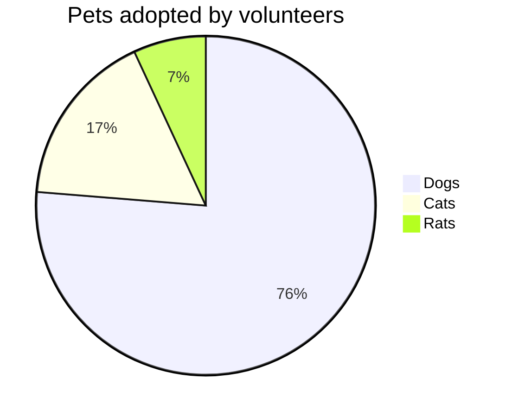
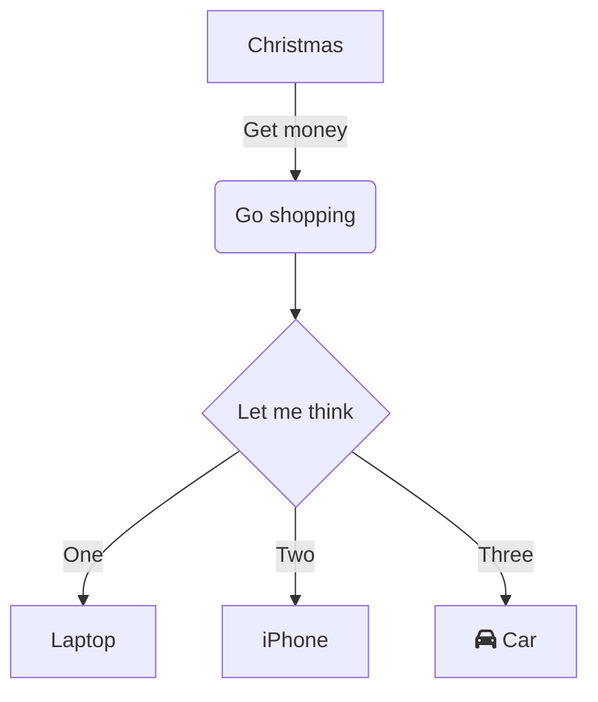
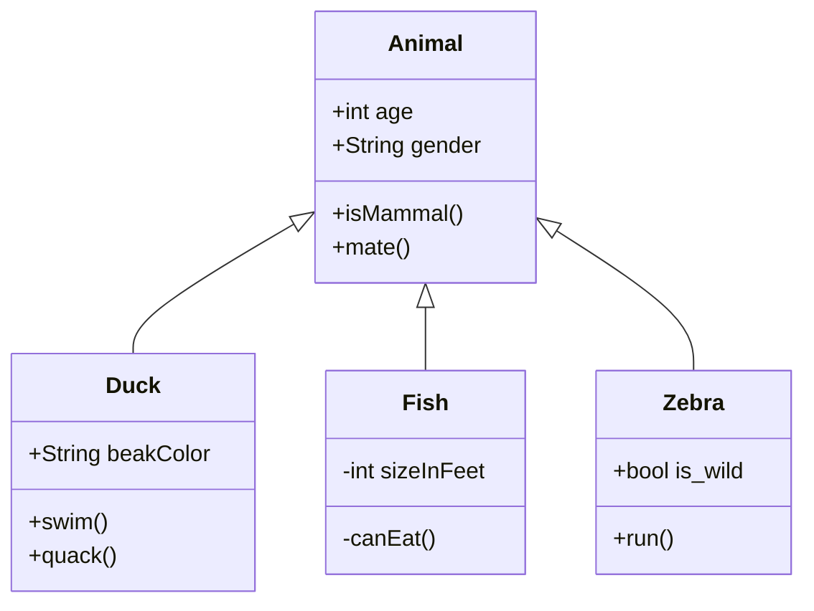
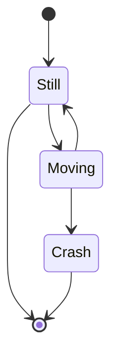

---
layout: post
title: perifericos de entrada y salida
subtitle: intalamos drivers, perifericos de entrada y salida
author: Jeffrey
categories: jekyll
tags: jekyll theme yat
sidebar: []
---

<h1>Controladores de Entrada/Salida
</h1>

Un controlador de E/S conecta dispositivos de entrada y salida (E/S) al sistema de bus de una unidad central de procesamiento (CPU). Generalmente se comunica con la CPU y con la memoria del sistema a través del bus del sistema y puede controlar muchos dispositivos. El control suele comenzar en la CPU, que envía instrucciones al controlador de E/S acerca de cómo deben manejarse los dispositivos y las señales periféricas conectadas a este.

<h2>Drivers</h2>

Un driver o controlador es un pequeño archivo presente en cada componente, accesorio y hardware tu ordenador. Su función es la de hacer de 'enlace' entre el sistema operativo que tienes instalado y el hardware o los periféricos instalados, tanto los internos como los externos

<!--

### 1. Pie chart

### 2. sequence diagram

@startmermaid
sequenceDiagram
  Alice ->> Bob: Hello Bob, how are you?
  Bob-->>John: How about you John?
  Bob--x Alice: I am good thanks!
  Bob-x John: I am good thanks!
  Note right of John: Bob thinks a long long time, so long that the text does not fit on a row.
  
  Bob-->Alice: Checking with John...
  Alice->John: Yes... John, how are you?
@endmermaid

### 3. Class diagram

### 4. State diagram

-->
